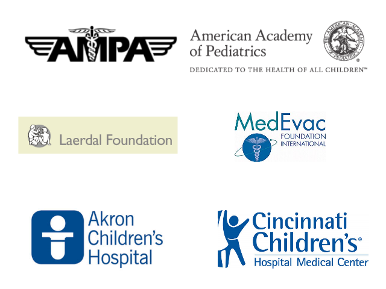

```{r setup, include=FALSE}
knitr::opts_chunk$set(echo = TRUE)
```


The Ground Air Medical qUality Transport Quality Improvement Collaborative uses the GAMUT Database as a free resource for transport teams to track, report, and analyze their performance on transport-specific quality metrics by comparing it to other program's.

## The vision

To facilitate medical transport programs of all types collaborating to improve the quality of care they deliver. This is achieved though the following:  

 - Establishing strict definitions for quality metrics that are agreed-upon, important, reliable, relevant and feasible to data gather.  
 - Developing a database and the infrastructure for programs to track, report, and analyze their performance by comparing it to other programs.  
  - Identifying practices used by the high performing transport teams for each of the metrics and widespread adaptation of these best practices across participating programs.
  


## Do you want to improve your team's performance?

<center><h3><a href="join.html">Join us</a></h3></center>

<center></center>

For more information contact:  

> Michael Bigham, MD, FAAP, FCCM <a href="mailto:mbigham@chmca.org">mbigham@chmca.org</a>  
> Hamilton Schwartz, MD, FAAP  <a href="mailto:hamilton.schwartz@cchmc.org">hamilton.schwartz@cchmc.org</a>


